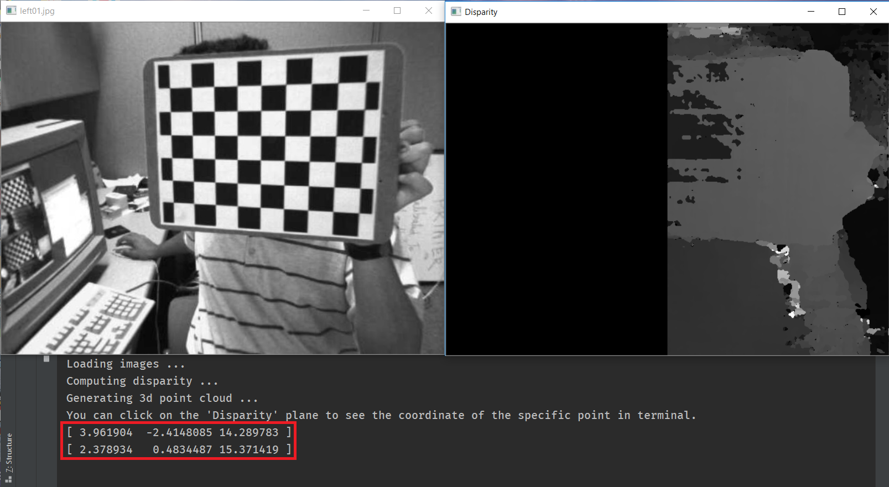

### Camera Model
This project gradually designs a pipeline to estimate the depth with cameras. It also provides functions for camera calibration, rectification and so on.

----

### Usage
**Catalogue**
1. [Single Camera Calibration](#scc)
1. [Stereo Camera Calibration](#sc)
1. [Stereo Matching](#sm)

Clone the repository to your machine.
```bash
git clone https://github.com/XJay18/CameraModel.git
```

Enter the main directory
```bash
cd CameraModel/
```

#### <span id="scc">Single Camera Calibration</span>
Single camera calibration uses images captured from one camera to calibrate the camera (i.e., to get the intrinsics and extrinsics of the camera). To use this utility, you can run `single_cal.py` as following:
```bash
python single_cal.py [-h] [-p PATH] [-t TARGET] [-s] [-u]
```
The details of the command line arguments are:
```
optional arguments:
-h, --help            show this help message and exit
-p PATH, --path PATH  Specify the directory where the images are stored.
-t TARGET, --target TARGET
                        Specify the directory where the undistorted images
                        will be stored. Note that only the flag '-u','--
                        undistort' is set will the images be saved.
-s, --show            Whether to show chessboard corners when calibrating.
-u, --undistort       Whether to run the undistort function to undistort the
                        images.
```
By default, this script will use the images stored at `data/left` to calibrate the camera.

You can use `-u` or `--undistort` to undistort the original images. 

An example of the original image:


An example of the corresponding undistort image:


#### <span id="sc">Stereo Camera Calibration</span>
Stereo camera calibration uses images captured from two different cameras to calibrate the two cameras and get the transformation from the first camera's coordinates to the second one. To use this utility, you can run `stereo_cal.py` as following:

```bash
python stereo_cal.py [-h] [-lp LEFT_PATH] [-rp RIGHT_PATH] [-lt LEFT_TARGET]
                     [-rt RIGHT_TARGET] [-ct CHECKED_TARGET] [-r] [-s] [-c]
```
The details of the command line arguments are:
```
optional arguments:
  -h, --help            show this help message and exit
  -lp LEFT_PATH, --left_path LEFT_PATH
                        Specify the directory where the images of left camera
                        are stored.
  -rp RIGHT_PATH, --right_path RIGHT_PATH
                        Specify the directory where the images of right camera
                        are stored.
  -lt LEFT_TARGET, --left_target LEFT_TARGET
                        Specify the directory where the rectified images of
                        left camera will be stored. Note that only the flag
                        '-r','--rectified' is set will the images be saved.
  -rt RIGHT_TARGET, --right_target RIGHT_TARGET
                        Specify the directory where the rectified images of
                        right camera will be stored. Note that only the flag
                        '-r','--rectified' is set will the images be saved.
  -ct CHECKED_TARGET, --checked_target CHECKED_TARGET
                        Specify the directory where the rectified images in
                        pair will be stored. Note that only the flag '-r','--
                        rectified' and '-c','--check' are set will the images
                        be saved.
  -r, --rectified       Whether to run the rectify function to rectify the
                        images.
  -s, --show            Whether to show the rectified images. Note that only
                        the flag '-r','--rectified' is set will the images be
                        shown.
  -c, --check           Whether to visualize the results of rectified images
                        in pair.
```
By default, this script will use the images stored at `data/left` and `data/right` to calibrate the cameras.

An example of the image pair after rectification:


#### <span id="sm">Stereo Matching</span>
Stereo matching uses the images captured from both the left camera and right camera to generate a disparity map. We can then use the disparity map to estimate the depth of a specific point in 3D coordinates. To use this utility, you can run `stereo_match.py` as following:
```bash
python stereo_match.py [-h] [-lp LEFT_PATH] [-rp RIGHT_PATH] [-lr LEFT_RECT]
                       [-rr RIGHT_RECT] [-pt PLY_TARGET]
                       [-dt DISPARITY_TARGET] [-s]
```
The details of the command line arguments are:
```
optional arguments:
-h, --help            show this help message and exit
-lp LEFT_PATH, --left_path LEFT_PATH
                      Specify the directory where the images of left camera
                      are stored.
-rp RIGHT_PATH, --right_path RIGHT_PATH
                      Specify the directory where the images of right camera
                      are stored.
-lr LEFT_RECT, --left_rect LEFT_RECT
                      Specify the directory where the rectified images of
                      left camera is stored.
-rr RIGHT_RECT, --right_rect RIGHT_RECT
                      Specify the directory where the rectified images of
                      right camera is stored.
-pt PLY_TARGET, --ply_target PLY_TARGET
                      Specify the directory where the ply files will be
                      stored. These .ply files can be viewed in 3D cloud
                      points using MeshLab (http://meshlab.sourceforge.net/)
                      Note that only the flag '-s','--save' is set will the
                      files be saved.
-dt DISPARITY_TARGET, --disparity_target DISPARITY_TARGET
                      Specify the directory where the disparity images will
                      be stored. Note that only the flag '-s','--save' is
                      set will the images be saved.
-s, --save            Whether to save the ply files and disparity images.
```
By default, this function will take the images stored at `data/left` and `data/right` to calibrate the cameras, and then use the rectified images stored at `data/left_rectified` and `data/right_rectified` to generate the disparity maps. 

Once you run the script, you can see a series of window pairs on your machine:


You can click on some locations on the `Disparity` window (i.e., the right window), and the program will print the estimated 3D coordiantes of the point:



You can click `q` or `Q` on keyboard to stop the program, and click other keys to continue the next pairs.

You can use `-s` or `--save` to save the `ply` files[^1] and disparity maps. By default, the disparity images will be saved at `data/disparity`.


[^1]: Resulting `ply` file can be easily viewed using [MeshLab](http://meshlab.sourceforge.net/).